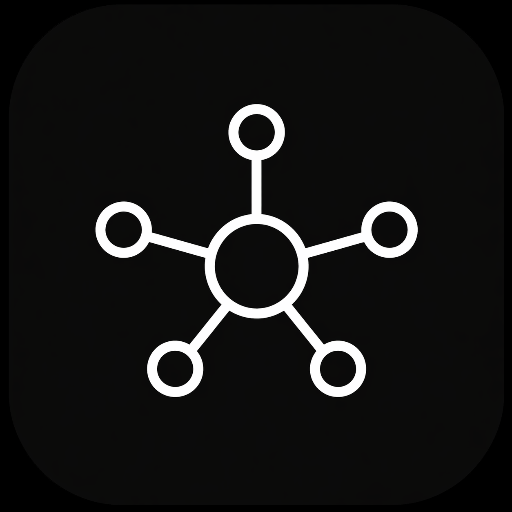

<div align="center">
  

  <h1>Agent Hub</h1>

  <p><strong>One place to talk to all your AI agents.</strong><br/>
  Claude Code, Codex, Hermes, and OpenClaw in a single native macOS app — local or over SSH.</p>

  <p>
    <a href="https://agent-hub.tools/"><strong>agent-hub.tools</strong></a>
    &nbsp;·&nbsp;
    <a href="https://agent-hub.tools/claude-code-gui">Claude Code GUI</a>
    &nbsp;·&nbsp;
    <a href="https://github.com/OmarDadabhoy/agenthub/releases/latest">Download</a>
    &nbsp;·&nbsp;
    <a href="CONTRIBUTING.md">Contributing</a>
  </p>

  <p>
    
    
    
    
    
  </p>
</div>

---

## What is Agent Hub?

Agent Hub is an **open-source native macOS app** that unifies the AI agent CLIs you already use — **[Claude Code](https://docs.claude.com/en/docs/claude-code)** (Anthropic), **[Codex](https://developers.openai.com/codex)** (OpenAI), **Hermes** (Nous Research), and **OpenClaw** — into one calm, keyboard-first chat window.

Point it at your laptop and it spawns the agent CLI locally. Point it at `omar@prod-1.fly.dev` and it runs over SSH. Same UI, same thread history, same slash commands, same permission model. The terminal version of these agents is great; Agent Hub is what you reach for when you want multiple parallel threads, visual tool-approval with diffs, image paste, and a sidebar of remote hosts.

## Highlights

- **Real CLIs under the hood.** Agent Hub wraps the official `claude`, `codex`, `hermes`, and `openclaw` binaries. Every feature the CLI has — `CLAUDE.md`, MCP servers, memory files, slash commands — works identically.
- **Local or SSH, per thread.** Switch a thread's target host in one click. Your Mac is the front-end; the agent runs wherever you tell it to.
- **Granular permissions.** Per-agent `ask`, `acceptEdits`, or `bypassPermissions`. The approval dialog shows the exact tool call and arguments before anything runs.
- **Slash commands, fuzzy-found.** `/plan`, `/review`, `/compact`, `/memory`, `/cost` — every command registered by every provider, keyboard-searchable.
- **Paste images, drop files.** Screenshots from the clipboard and files from Finder go straight into the thread.
- **Hot-swap models per thread.** `claude-opus-4.7` → `claude-sonnet-4.6` → `gpt-5.5` without restarting.
- **Any OpenAI-compatible endpoint.** llama.cpp, vLLM, Groq, Together — use the `openai-compat` provider.
- **Zero telemetry.** No analytics. Your conversations go only to whichever provider that thread is configured for.

## Screenshot

<p align="center">
  <a href="https://agent-hub.tools/">
    
  </a>
</p>

## Supported agents

| Agent | Provider | Local | SSH | Notes |
|---|---|:---:|:---:|---|
| [Claude Code](https://docs.claude.com/en/docs/claude-code) | Anthropic | ✓ | ✓ | Uses your `claude` CLI session. `claude-opus-4.7`, `sonnet-4.6`, `haiku-4.5`. |
| [Codex](https://developers.openai.com/codex) | OpenAI | ✓ | ✓ | `gpt-5.5` with effort levels. |
| Hermes | Nous Research | ✓ | ✓ | Long-horizon research with tool use. |
| OpenClaw | Open source | ✓ | ✓ | Desktop automation (click, type, file ops). |
| Terminal | Local/SSH | ✓ | ✓ | Full PTY-backed xterm tab. |
| `openai-compat` | Any | ✓ | ✓ | Point at llama.cpp, vLLM, Groq, etc. |

## Install

### Download (recommended)

Grab the latest `.dmg` from [GitHub Releases](https://github.com/OmarDadabhoy/agenthub/releases/latest). Requires **macOS 11+ on Apple Silicon**. ~183 MB.

### From source

```bash
git clone https://github.com/OmarDadabhoy/agenthub.git
cd agenthub
npm install
npm start
```

Convenience launcher (detached, closes terminal):

```bash
./launch.sh
# or
npm run start-bg
```

Create an unsigned local DMG/ZIP build:

```bash
CSC_IDENTITY_AUTO_DISCOVERY=false npm run dist:mac
```

Release signing, notarization, and in-app update publishing are documented in [RELEASE.md](RELEASE.md).

### Prerequisites (for the agents you want to use)

Agent Hub doesn't re-implement any agent — it spawns the real CLIs. Install the ones you want:

```bash
npm install -g @anthropic-ai/claude-code   # Claude Code (Anthropic)
npm install -g @openai/codex               # Codex (OpenAI)
```

Then `claude login` / `codex login`, or drop an API key into Agent Hub's provider settings.

## Usage

**New thread:** `⌘N`, then pick a provider and a target host (local or any SSH host you've configured).

**Slash commands:** type `/` in the composer. Fuzzy-search to narrow.

**Tool approvals:** when an agent wants to run a tool, a dialog shows the exact call. `⌘↵` approves, `⌘⌫` denies. Per-agent profiles let you auto-approve safe edits.

**Switch models:** `/model` in any thread, or click the model pill in the header.

**Per-agent permission modes:**

- `ask` — prompt for every tool call.
- `acceptEdits` — auto-approve safe in-repo edits (Read, Write, Edit).
- `bypassPermissions` — never ask. Use sparingly.

## How it works

```
┌──────────────────┐        ┌─────────────────────┐
│ Agent Hub (UI)   │ stdio  │ claude / codex /    │
│ native macOS app │ ─────► │ hermes / openclaw   │
└──────────────────┘ pty    │  (real CLIs)        │
        │                   └─────────────────────┘
        │ ssh
        ▼
┌──────────────────┐
│ any VPS you own  │  ← agent runs HERE, not on your laptop
└──────────────────┘
```

For each thread, Agent Hub spawns the provider's CLI (locally via `node-pty`, or remotely via `ssh`), captures stdout/stderr, parses tool calls and model events, and renders them as a native chat UI. Your messages go into the CLI's stdin. Nothing is proxied, nothing is rewritten, nothing is logged.

## FAQ

**Does it work on Windows or Linux?** Today it's macOS-only (Apple Silicon). Intel and universal builds are supported by `electron-builder` but not yet shipped.

**Does Agent Hub store my API keys?** No. Keys live in the OS keychain on the machine where the CLI runs — locally on your Mac, or on the remote host in SSH mode.

**Does it send any data to a server?** No. Zero telemetry. Conversations go only to whichever provider that thread is configured for.

**Can I use my own models?** Yes. Any OpenAI-compatible endpoint works via the `openai-compat` provider.

**Can I add a new provider?** One file in [`providers/`](providers/) — see [CONTRIBUTING.md](CONTRIBUTING.md). `providers/openai-compat.js` is a good starting point.

**Why Electron?** Agent Hub is mostly plumbing around real CLIs — the perf-sensitive work (model inference, shell commands) happens in the CLI processes, not the UI. Electron gets us native-feel on macOS fastest.

## Contributing

Pull requests welcome. See [CONTRIBUTING.md](CONTRIBUTING.md) for the full guide. If you're adding a new provider, look at [`providers/openai-compat.js`](providers/openai-compat.js) first — it's the cleanest template.

Found a bug? [Open an issue](https://github.com/OmarDadabhoy/agenthub/issues/new/choose).

Security issue? Please email **omar.dadabhoy@gmail.com** instead of opening a public issue. Details in [SECURITY.md](.github/SECURITY.md).

## Related

- **Website:** [agent-hub.tools](https://agent-hub.tools/)
- **Claude Code GUI page:** [agent-hub.tools/claude-code-gui](https://agent-hub.tools/claude-code-gui)
- **Claude Code docs:** [docs.claude.com/en/docs/claude-code](https://docs.claude.com/en/docs/claude-code)
- **Codex docs:** [developers.openai.com/codex](https://developers.openai.com/codex)

## License

[MIT](LICENSE) © [Omar Dadabhoy](https://github.com/OmarDadabhoy) / [Potarix](https://potarix.com/)

---

<p align="center"><sub>Made for the terminal-folk.</sub></p>
